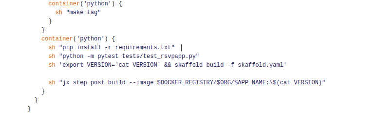

## Prerequisites.
- GitHub API token.

### Setting up environment.

- Create a 16GB Ubuntu 16.04 DigitalOcean droplet.

- Install `Docker`.
```
$ apt update
$ apt install docker.io
```
- Install `Minikube`.

```
$ curl -Lo minikube https://storage.googleapis.com/minikube/releases/v0.32.0/minikube-linux-amd64 && chmod +x minikube && sudo cp minikube /usr/local/bin/ && rm minikube
```
- Install `kubectl`.
```
$ sudo apt-get update && sudo apt-get install -y apt-transport-https
$ curl -s https://packages.cloud.google.com/apt/doc/apt-key.gpg | sudo apt-key add -
$ sudo touch /etc/apt/sources.list.d/kubernetes.list 
$ echo "deb http://apt.kubernetes.io/ kubernetes-xenial main" | sudo tee -a /etc/apt/sources.list.d/kubernetes.list
$ sudo apt-get update
$ sudo apt-get install -y kubectl
```

- Install `JX`.
```
$ curl -L https://github.com/jenkins-x/jx/releases/download/v1.3.689/jx-linux-amd64.tar.gz | tar xzv 
sudo mv jx /usr/local/bin
```
- Install `socat`
```
$ apt install socat
```
- Configure Docker to use Insecure registries.
```
cat <<EOF> /etc/docker/daemon.json
{
  "insecure-registries" : ["0.0.0.0/0"]
}
EOF
```

- Restart Docker service.
```
$ systemctl restart docker
```

- Verify Docker is configured with the insecure registries.
```
$ docker info

Containers: 10
 Running: 0
 Paused: 0
 Stopped: 10
Images: 30
Server Version: 18.06.0-ce
Storage Driver: overlay2
 Backing Filesystem: extfs
 Supports d_type: true
 Native Overlay Diff: true
.
.
.
.
.
.

Insecure Registries:
 0.0.0.0/0
 127.0.0.0/8
Live Restore Enabled: false
```

### Create a Minikube cluster using the JX.

- Create cluster using following command.
```
$ jx create cluster minikube --cpu=5 --default-admin-password=admin --vm-driver=none --memory=13312
```
It will ask you for install missing dependency, Countinue with installing the dependencies.

- Provide your Github username and API token. It will also ask you for the Jenkins API token. Login to y

- Once Cluster created we can go to next step.

- Get the list of various URLs created by the JX.
```
$ jx get urls
Name                      URL
jenkins                   http://jenkins.jx.206.189.227.210.nip.io
jenkins-x-chartmuseum     http://chartmuseum.jx.206.189.227.210.nip.io
jenkins-x-docker-registry http://docker-registry.jx.206.189.227.210.nip.io
jenkins-x-monocular-api   http://monocular.jx.206.189.227.210.nip.io
jenkins-x-monocular-ui    http://monocular.jx.206.189.227.210.nip.io
nexus                     http://nexus.jx.206.189.227.210.nip.io
```

- Set some requires RBAC policies to Service Accounts in `jx`, `jx-staging` and `jx-production` namespaces. There is bug with [JX](https://github.com/jenkins-x/jx/issues/2591). To fix this bug we have to create these RBAC rules.

```
$ kubectl create clusterrolebinding jx-staging1 --clusterrole=cluster-admin --user=admin --user=expose --group=system:serviceaccounts --serviceaccount=jx-staging:expose --namespace=jx-staging

$ kubectl create clusterrolebinding jx-production1 --clusterrole=cluster-admin --user=admin --user=expose --group=system:serviceaccounts --serviceaccount=jx-production:expose --namespace=jx-productions

$ kubectl create clusterrolebinding jx-binding1 --clusterrole=cluster-admin --user=admin --user=expose --group=system:serviceaccounts --serviceaccount=jx:expose --namespace=jx

```


### Create a Application.

- Clone the application repository.
```
$  git clone https://github.com/cloudyuga/rsvpapp.git

$ cd rsvpapp

$ rm -r .git/
```

- Create the application in `jx` and on `github` using following command.
```
$ jx import
```

It will ask for you some inputs. Provide proper Inputs.

- It will create github repository for your application.


- Modify `charts/rsvpapp/values.yaml` files.
```
$ cat <<EOF> charts/rsvpapp/values.yaml 

# Default values for python.
# This is a YAML-formatted file.
# Declare variables to be passed into your templates.
replicaCount: 1
image:
  repository: draft
  tag: dev
  pullPolicy: IfNotPresent
service:
  name: rsvpapp
  type: ClusterIP
  externalPort: 80
  internalPort: 5000
  annotations:
    fabric8.io/expose: "true"
    fabric8.io/ingress.annotations: "kubernetes.io/ingress.class: nginx"
resources:
  limits:
    cpu: 100m
    memory: 128Mi
  requests:
    cpu: 100m
    memory: 128Mi
ingress:
  enabled: false
EOF
```

- Edit `charts/preview/requirements.yaml`.
```
- name: mongodb-replicaset
  repository: https://kubernetes-charts.storage.googleapis.com/
  version: 3.5.5
```


- Create `charts/rsvpapp/requirements.yaml`
```
$ cat <<EOF> charts/rsvpapp/requirements.yaml

dependencies:
- name: mongodb-replicaset
  repository: https://kubernetes-charts.storage.googleapis.com/
  version: 3.5.5

EOF

```

- Update Helm chart deployment template at `charts/rsvpapp/templates/deployment.yaml`

```
$ cat <<EOF> charts/rsvpapp/templates/deployment.yaml

apiVersion: extensions/v1beta1
kind: Deployment
metadata:
  name: {{ template "fullname" . }}
  labels:
    draft: {{ default "draft-app" .Values.draft }}
    chart: "{{ .Chart.Name }}-{{ .Chart.Version | replace "+" "_" }}"
spec:
  replicas: {{ .Values.replicaCount }}
  template:
    metadata:
      labels:
        draft: {{ default "draft-app" .Values.draft }}
        app: {{ template "fullname" . }}
{{- if .Values.podAnnotations }}
      annotations:
{{ toYaml .Values.podAnnotations | indent 8 }}
{{- end }}
    spec:
      containers:
      - name: {{ .Chart.Name }}
        image: "{{ .Values.image.repository }}:{{ .Values.image.tag }}"
        env:
        - name: MONGODB_HOST
          value: "mongodb://{{.Release.Name}}-mongodb-replicaset-0.{{.Release.Name}}-mongodb-replicaset,{{.Release.Name}}-mongodb-replicaset-1.{{.Release.Name}}-mongodb-replicaset,{{.Release.Name}}-mongodb-replicaset-2.{{.Release.Name}}-mongodb-replicaset:27017"
        imagePullPolicy: {{ .Values.image.pullPolicy }}
        ports:
        - containerPort: {{ .Values.service.internalPort }}
        resources:
{{ toYaml .Values.resources | indent 12 }}


EOF
````

- In Jenkinsfile, In stages `stage('CI Build and push snapshot')` and `stage('Build Release')` replace  `sh "python -m unittest"` with below commands.
```
            sh "pip install -r requirements.txt"  
            sh "python -m pytest tests/test_rsvpapp.py" 
```
So configuration will look like.



- Push these changes to the GitHub
```
$ git add *
$ git commit -m update
$ git push
```


- When we push our changes to GitHub. It will trigger new build of you application. Open the Jenkins UI and you will there see the console output of your application build.

- Once your application is build and deployed.  will list application using the command.
```
$ jx get app

APPLICATION STAGING PODS URL                                             PRODUCTION PODS URL
rsvpapp     0.0.3   1/1  http://rsvpapp.jx-staging.167.99.234.182.nip.io                 
```
At this given URL you can access the application.

Now our application is running at above given URL.

- You can get activity of the application by using.
```
$ jx get activity -f rsvpapp 
````

- List the pod running in `jx-staging` namespace.
```
$ kubectl get po -n jx-staging
NAME                                 READY     STATUS    RESTARTS   AGE
jx-staging-mongodb-replicaset-0      1/1       Running   0          6m
jx-staging-mongodb-replicaset-1      1/1       Running   0          6m
jx-staging-mongodb-replicaset-2      1/1       Running   0          5m
jx-staging-rsvpapp-c864c4844-4fw5z   1/1       Running   0          6m
```
## Promote application to the Production.
```
$ jx promote rsvpapp --version=0.0.3 --env=production
```
- After successful promotion you can check the list of application.
```
$ jx get app
APPLICATION STAGING PODS URL                                             PRODUCTION PODS URL
rsvpapp     0.0.3   1/1  http://rsvpapp.jx-staging.167.99.234.182.nip.io 0.0.3      1/1  http://rsvpapp.jx-production.167.99.234.182.nip.io
```
We can confirm that our application is promoted to the production by accessing the application URL provided in above output.

- List the pods in `jx-production`.
```
$ kubectl get pod -n jx-production
NAME                                     READY     STATUS    RESTARTS   AGE
jx-production-mongodb-replicaset-0       1/1       Running   0          1m
jx-production-mongodb-replicaset-1       1/1       Running   0          1m
jx-production-mongodb-replicaset-2       1/1       Running   0          55s
jx-production-rsvpapp-54748d68bd-zjgv7   1/1       Running   0          1m 
```
