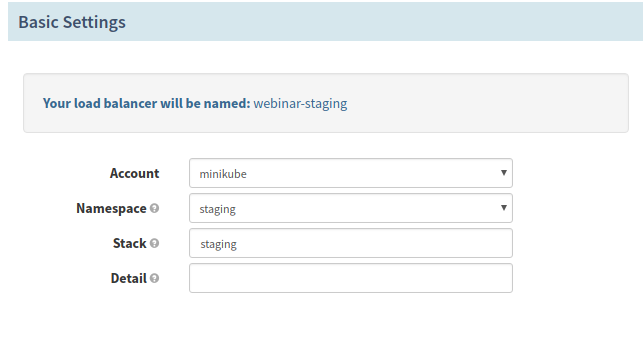
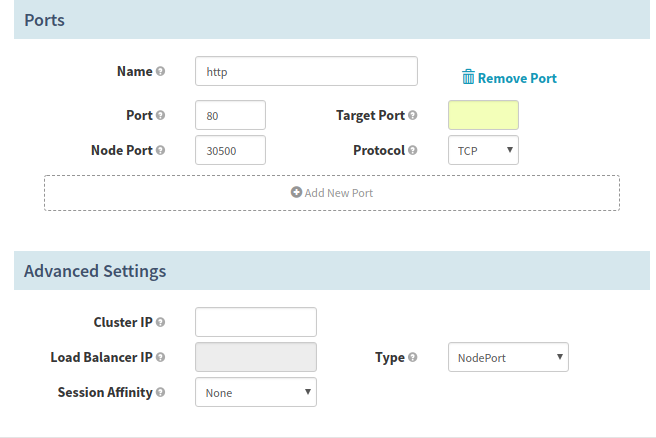
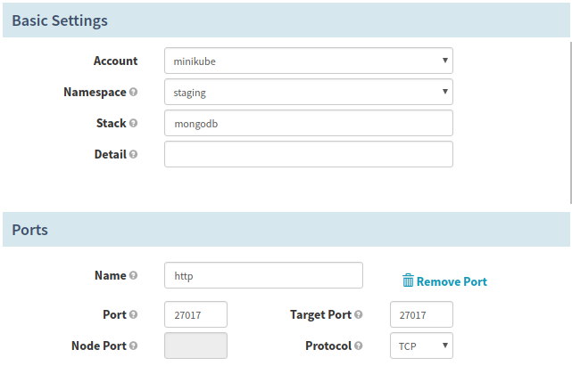
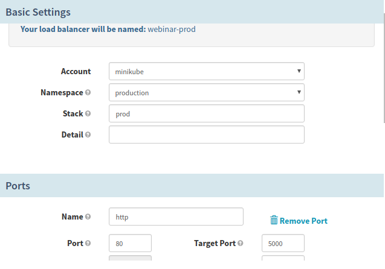
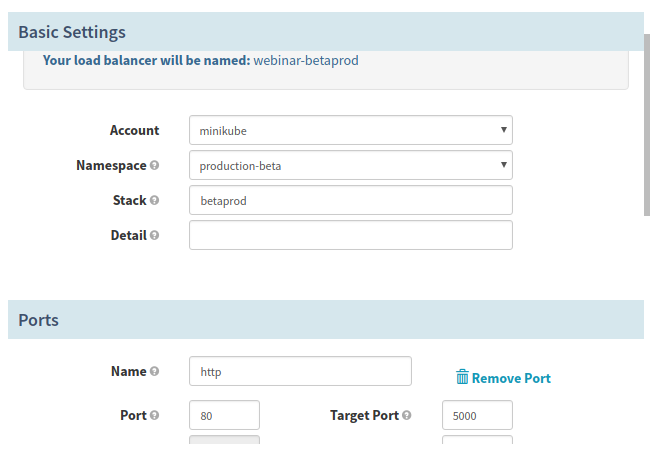
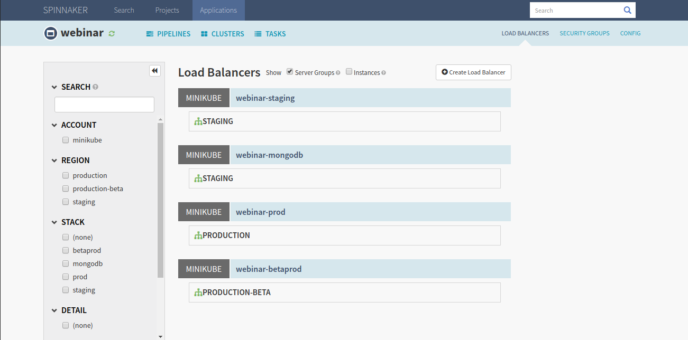

## Spinnaker.

### Prerequisites
- Kubernetes Cluster with node more than 8GB RAM.
- Helm must be installed. Tiller pod must be running.
- You must have storage class.

## Labs

- List the Kubernetes nodes.
```command
$ kubectl get nodes
NAME       STATUS   ROLES    AGE   VERSION
minikube   Ready    master   32s   v1.10.0
```
- Verify you have default storage class.
```
$  kubectl get sc
NAME                 PROVISIONER                AGE
standard (default)   k8s.io/minikube-hostpath   41s
```

- Verify the Tiller pod is running.
```command
$ kubectl get po -n kube-system | grep tiller

tiller-deploy-64c9d747bd-dglxj   1/1       Running   0          14s
```

- Clone the reposistory.
```
$ git clone https://github.com/vishalcloudyuga/charts.git
```

- Go inside the repository.
```
$ cd charts/stable/spinnaker
```

- Update the `values.yaml`
```
accounts:
- name: dockerhub
  address: https://index.docker.io
  username: nkhare
  password: *******
  repositories:
    - library/alpine
    - library/ubuntu
    - library/centos
    - library/nginx
    - library/mongo      
    - nkhare/rsvpapp

```
In `values.yaml` under `accounts` section update your `dockerhub username and password` in my case it is `nkhare` and also add Dockerhub repository on which you want Perform CICD. for me it is `nkhare/rsvpapp`.

- Upload the kubernetes config in secret

1. Upload your kubeconfig to a secret with the key `config` in the cluster you are installing Spinnaker to.

    ```
    $ kubectl create secret generic --from-file=$HOME/.kube/config my-kubeconfig 
    ```

2. Set the following `values.yaml` of the chart:

    ```yaml
    kubeConfig:
      enabled: true
      secretName: my-kubeconfig
      secretKey: config
      contexts:
      # Names of contexts available in the uploaded kubeconfig
      - minikube
    ```
- Here my context name is `minikube`.


- Update the Helm Dependencies.
```
$ helm dependency update
```

- Install the Spinnaker.
```
$ helm install --name=spinnaker  .
```

- Get the list of pods.
```
$ kubectl get pod

NAME                                              READY     STATUS      RESTARTS   AGE
spinnaker-create-bucket-q8h89                     0/1       Completed   2          1h
spinnaker-jenkins-66444fcbdc-gmlh7                1/1       Running     0          1h
spinnaker-minio-695b84f697-h8m5v                  1/1       Running     0          1h
spinnaker-redis-778bc8d67f-knmpr                  1/1       Running     0          1h
spinnaker-spinnaker-clouddriver-d94579ccd-cb9z6   1/1       Running     0          1h
spinnaker-spinnaker-deck-7bdcc48956-rdbsl         1/1       Running     0          1h
spinnaker-spinnaker-echo-644c55d45f-mdrgm         1/1       Running     0          1h
spinnaker-spinnaker-front50-55c459975d-9vmjn      1/1       Running     0          1h
spinnaker-spinnaker-gate-6fcc4ff6d5-c4g8n         1/1       Running     5          1h
spinnaker-spinnaker-igor-764db658d8-xnpnq         1/1       Running     0          1h
spinnaker-spinnaker-orca-57f9b94d98-kc68m         1/1       Running     0          1h
spinnaker-spinnaker-rosco-6fb5f68b44-vz888        1/1       Running     0          1h
spinnaker-upload-build-image-shhfc                0/1       Completed   0          1h
spinnaker-upload-run-pipeline-7g4fv               0/1       Completed   0          1h
spinnaker-upload-run-script-c6b52                 0/1       Completed   0          1h

```

- Copy your Kubernetes `config` to your local computer so you can access the services using the `kubectl port-forward`.

- **Expose Spinnaker**.
```
 $ export DECK_POD=$(kubectl get pods --namespace default -l "component=deck,app=spinnaker-spinnaker" -o jsonpath="{.items[0].metadata.name}")
 
 $ kubectl port-forward --namespace default $DECK_POD 9000
```
You can access the Spinnaker UI by opening your browser to: http://127.0.0.1:9000.

- **Expose Jenkins**.
```
 $  export JENKINS_POD=$(kubectl get pods --namespace default -l "app=spinnaker-jenkins" -o jsonpath="{.items[0].metadata.name}")
 
 $ kubectl port-forward --namespace default $JENKINS_POD 8080
```
You can access the Jenkins UI by opening your browser to: http://127.0.0.1:9000.

## Create a Trigger pipeline in Jenkins.

- Fork repository `https://github.com/nkhare/rsvpapp.git` repository to your account.
This repository have branches like `master` and `dev`.

- Open Jenkins UI.
In Jenkin UI.

    Click the Credentials link in the sidebar

    Click on the Global credentials domain

    Click [Add Credential]
    
- For DockerHub credential give your username and password and `dockerhub` as ID. 
- For GitHub credential give your username and password and `github` as ID

- Update the plugins (This is mandatory)

Install Some Plugins.
```
- Pipeline GitHub Notify Step plugin
- GitHub API plugin
- GitHub plugin
- GitHub Integration plugin
```
**Pipeline For `dev` Branch.**

- Create a new pipeline project `dev`.

- Make sure the GitHub project is pointing to your GitHub repository of RSVP application. Like in my case, it is
 `https://github.com/nkhare/rsvpapp.git`

- In the Build Trigger click on Poll SCM and enter `* * * * *`, which means the Jenkins would pull our GitHub repository, 
`https://github.com/nkhare/rsvpapp.git` every minute and if there is any, a build would triggered.

- In the `pipeline` section, create the `Groovy script`  like following.
```
podTemplate(label: 'mypod', containers: [
    containerTemplate(name: 'docker', image: 'docker', ttyEnabled: true, command: 'cat'),
  ],
  volumes: [
    hostPathVolume(mountPath: '/var/run/docker.sock', hostPath: '/var/run/docker.sock'),
  ]) {
    node('mypod') {

        stage('Build the Image') {
            container('docker') {
                git branch: 'dev', credentialsId: 'github', url: 'https://github.com/nkhare/rsvpapp.git'
                withCredentials([[$class: 'UsernamePasswordMultiBinding', 
                        credentialsId: 'dockerhub',
                        usernameVariable: 'DOCKER_HUB_USER', 
                        passwordVariable: 'DOCKER_HUB_PASSWORD']]) 
                    sh "docker build -t ${env.DOCKER_HUB_USER}/rsvpapp:stage ."
                    sh "docker login -u ${env.DOCKER_HUB_USER} -p ${env.DOCKER_HUB_PASSWORD} "
                    sh "docker push ${env.DOCKER_HUB_USER}/rsvpapp:stage "
                }
            }
        }

   }

}
```

**Pipeline For `master` Branch.**

- Create a new pipeline project `master`.

- Make sure the GitHub project is pointing to your GitHub repository of RSVP application. Like in my case, it is
 `https://github.com/nkhare/rsvpapp.git`

- In the Build Trigger click on Poll SCM and enter `* * * * *`, which means the Jenkins would pull our GitHub repository, 
`https://github.com/nkhare/rsvpapp.git` every minute and if there is any, a build would triggered.

- In the `pipeline` section, create the `Groovy script`  like following.
```
podTemplate(label: 'mypod', containers: [
    containerTemplate(name: 'docker', image: 'docker', ttyEnabled: true, command: 'cat'),
  ],
  volumes: [
    hostPathVolume(mountPath: '/var/run/docker.sock', hostPath: '/var/run/docker.sock'),
  ]) {
    node('mypod') {

        stage('Build the Image') {
            container('docker') {
                git credentialsId: 'github', url: 'https://github.com/nkhare/rsvpapp'
                withCredentials([[$class: 'UsernamePasswordMultiBinding', 
                        credentialsId: 'dockerhub',
                        usernameVariable: 'DOCKER_HUB_USER', 
                        passwordVariable: 'DOCKER_HUB_PASSWORD']]) 
                    sh "docker build -t ${env.DOCKER_HUB_USER}/rsvpapp:prod ."
                    sh "docker login -u ${env.DOCKER_HUB_USER} -p ${env.DOCKER_HUB_PASSWORD} "
                    sh "docker push ${env.DOCKER_HUB_USER}/rsvpapp:prod "
                }
            }
        }

   }

}
```

Once Pipeline build, Goto your Forked Github repository . Make change in `dev` and `master` branch and come back to jenkins UI and you can see that your `dev` and `master` pipelines have been triggered.

## Spinnaker CD.

- Create 3 namespaces for our CD operations.
```
$ kubectl create ns staging
$ kubectl create ns production
$ kubectl create ns production-beta
```

- Go to the Spinnaker UI.

- Go to `Action` -> `Create Application` And Create application with Name=`webinar3` and enter your `Email ID`.

- Now Inside the Application you have create `Load Balancers`. 

- Click on `LOAD BALANCER` tab at upper right corner -> `Create Load Balancer`

Create a  4 Loadbalancers as following informantion.

**1 webinar3-staging**
In `Basic Settings`
  - `Account` = `local`
  - `Namespace` = `staging`
  - `Stack` = `staging`
  
  
  
In `Ports` change
  - `Target Port`= `5000`
  
In `Advance Settings` change
  - `Type` = `NodePort`
  
Go back to `Ports` section and change 
  - `Node Port` = `30500`

  

Click on `Create` button.

**2 webinar3-mongodb**

In `Basic Settings`
  - `Account` = `local`
  - `Namespace` = `staging`
  - `Stack` = `mongodb`

In `Ports` change
  - `Port` = `27017`
  - `Target Port`= `27017`




Keep other things as it is.

Click on `Create` button.

**3 webinar3-prod**

In `Basic Settings`
  - `Account` = `local`
  - `Namespace` = `production`
  - `Stack` = `prod`
  
In `Ports` section change  
  - `Target Port`= `5000`





Keep other things as it is.

Click on `Create` button.

**4 webinar3-betaprod**

In `Basic Settings`
  - `Account` = `local`
  - `Namespace` = `production`
  - `Stack` = `betaprod`
  
In `Ports` section change  
  - `Target Port`= `5000`





Keep other things as it is.

Click on `Create` button.


- Now You can See 4 Load-Balancer created there.




- Now if you check the namespace you can see that there are services created.
```
$ kubectl get svc -n staging
NAME                TYPE        CLUSTER-IP       EXTERNAL-IP   PORT(S)        AGE
cloudyuga-mongodb   ClusterIP   10.110.123.237   <none>        27017/TCP      4d
cloudyuga-staging   NodePort    10.106.15.208    <none>        80:30500/TCP   4d

$ kubectl get svc -n production
NAME             TYPE        CLUSTER-IP       EXTERNAL-IP   PORT(S)     AGE
cloudyuga-prod   ClusterIP   10.101.24.247    <none>        80/TCP      4d

$ kubectl get svc -n production-beta
NAME                 TYPE        CLUSTER-IP       EXTERNAL-IP   PORT(S)   AGE
cloudyuga-betaprod   ClusterIP   10.105.120.153   <none>        80/TCP    4d

```

- Lets create a backend database for our application in `production` namespace.
```
$ cat <<EOF | kubectl apply -n production -f -

apiVersion: apps/v1
kind: Deployment
metadata:
  name: rsvp-db
spec:
  replicas: 1
  selector:
    matchLabels:
      appdb: rsvpdb
  template:
    metadata:
      labels:
        appdb: rsvpdb
    spec:
      volumes:
        - name: voldb
          hostPath:
            path: /tmp
      containers:
      - name: rsvpd-db
        image: mongo:3.3
        volumeMounts:
        - name: voldb
          mountPath: /data/db
        env:
        - name: MONGODB_DATABASE
          value: rsvpdata
        ports:
        - containerPort: 27017
---
apiVersion: v1
kind: Service
metadata:
  name: mongodb
  labels:
    app: rsvpdb
spec:
  ports:
  - port: 27017
    protocol: TCP
  selector:
    appdb: rsvpdb
    
EOF
```


## Create a Spinnaker Pipeline.
- Click on `Pipelines` -> `Configure a new pipeline` 
- Give a name to pipeline as `staging`

- You will go to the Pipeline UI. Click on `Pipeline Actions` -> `Edit JSON` and paste following 
```

```


## Apply Istio Rules.

- Label the namespaces so istio-injection can be enabled in those namespaces and we can apply istio rules to the services running these namespaces.
```
$ kubectl label namespace production istio-injection=enabled

$ kubectl label namespace production-beta istio-injection=enabled
```


- Create ingress-Gateway.
```
kind: Gateway
metadata:
  name: cloudyuga
spec:
  selector:
    istio: ingressgateway # use istio default controller
  servers:
  - port:
      number: 80
      name: http
      protocol: HTTP
    hosts:
    - "*"
```

- Deploy this configuration.
```
$ kubectl apply -f gateway.yaml
```

- When the Production pipe ask for shifting 80% traffic to the application running in the `production-beta` namespace. When we apply this rule, it shifts 80% traffic to the application running in `production-beta` and 20% traffic to the the application  running in `production` namespace. All this application are exposed to the `cloudyuga` gateway we have created in earlier step.

```
apiVersion: networking.istio.io/v1alpha3
kind: VirtualService
metadata:
  name: cloudyuga
spec:
  hosts:
  - "*"
  gateways:
  - cloudyuga
  http:
  - route:
    - destination:
        host: cloudyuga-betaprod.production-beta.svc.cluster.local
        port:
          number: 80
      weight: 80
    - destination:
        host: cloudyuga-prod.production.svc.cluster.local
        port:
          number: 80
      weight: 20
```


- Deploy this rule when Spinnaker pipeline step ask you to shift 80% traffic to the `production-beta`.


- Create a Istio rule so it can shift 100% traffic to the application running in the `production` namepsace. And we also exposing this application with the `cloudyuga` gateway we have created earlier.

```
apiVersion: networking.istio.io/v1alpha3
kind: VirtualService
metadata:
  name: cloudyuga
spec:
  hosts:
  - "*"
  gateways:
  - cloudyuga
  http:
  - route:
    - destination:
        host: cloudyuga-betaprod.production-beta.svc.cluster.local
        port:
          number: 80
      weight: 0
    - destination:
        host: cloudyuga-prod.production.svc.cluster.local
        port:
          number: 80
      weight: 100
```

- Apply this rule when Spinnaker pipeline step ask for Shift 100% traffic to the application running in the production namespace.


