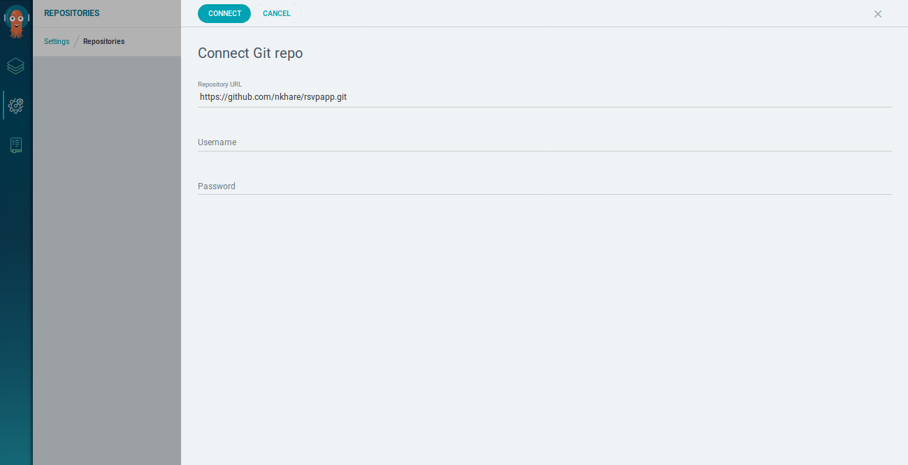
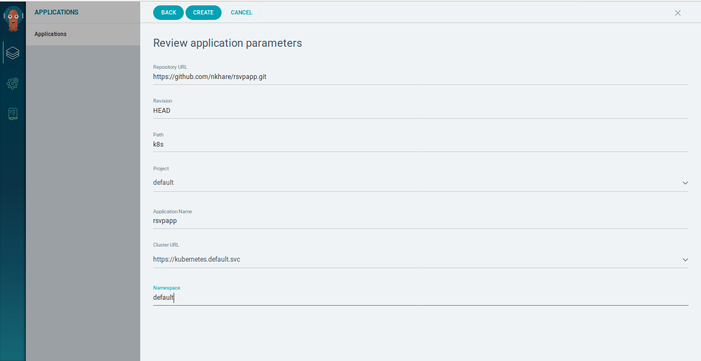
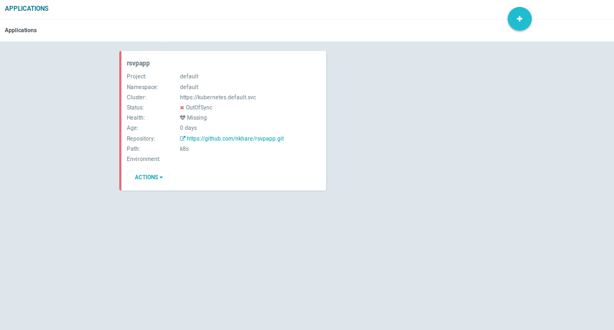
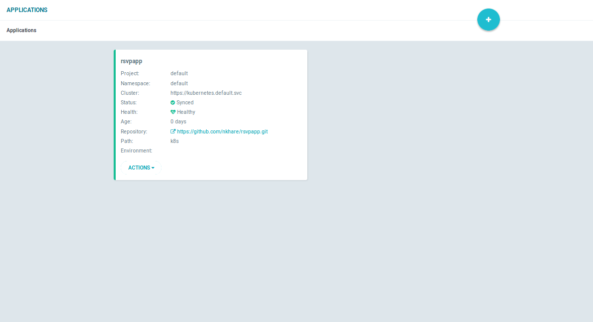
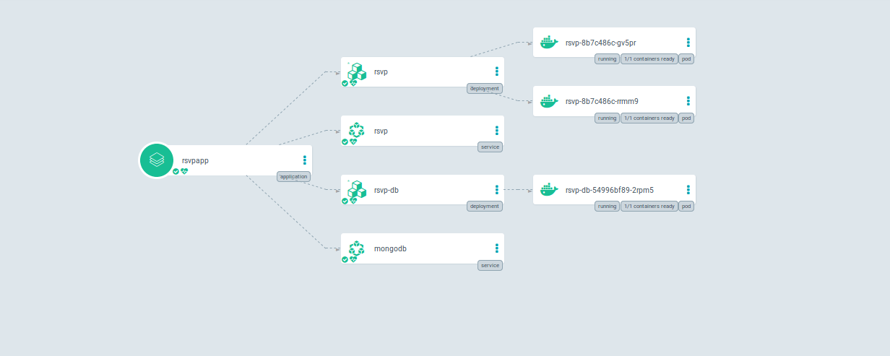

## Prerequisites
- Installed [kubectl](https://kubernetes.io/docs/tasks/tools/install-kubectl/) command-line tool
- [kubeconfig](https://kubernetes.io/docs/tasks/access-application-cluster/configure-access-multiple-clusters/) file.

## Deploy ArgoCD manifest on Kubernetes cluster

```command
kubectl create namespace argocd
kubectl apply -n argocd -f https://raw.githubusercontent.com/argoproj/argo-cd/v0.9.2/manifests/install.yaml
```
This will create a new namespace, `argocd`, where ArgoCD services and application resources will be deployed.

- Get the list of the Pods running in `argocd`.
```command
kubectl get pod -n argocd
```
```output
NAME                                      READY     STATUS    RESTARTS   AGE
application-controller-6d68475cd4-j4jtj   1/1       Running   0          1m
argocd-repo-server-78f556f55b-tmkvj       1/1       Running   0          1m
argocd-server-78f47bf789-trrbw            1/1       Running   0          1m
dex-server-74dc6c5ff4-fbr5g               1/1       Running   0          1m
```


## Download ArgoCD CLI tool

- Download the latest ArgoCD version:

On Mac:
```command
brew install argoproj/tap/argocd
```

On Linux:

```command
curl -sSL -o /usr/local/bin/argocd https://github.com/argoproj/argo-cd/releases/download/v0.9.2/argocd-linux-amd64
chmod +x /usr/local/bin/argocd
```

## Access the ArgoCD API server

By default, the ArgoCD API server is not exposed with an external IP. To access the API server,
choose one of the following means to expose the ArgoCD API server:

- Change the argocd-server service type to `NodePort`.

```command
kubectl patch svc argocd-server -n argocd -p '{"spec": {"type": "NodePort"}}'
```

- Get the argocd server of service.
```command
kubectl get svc -n argocd argocd-server
```


## Login using the CLI

- Login as the `admin` user. The initial password is autogenerated to be the pod name of the
ArgoCD API server. Password can be retrieved with the command.

```command
kubectl get pods -n argocd -l app=argocd-server -o name | cut -d'/' -f 2
```

- Using the above password, login to ArgoCD's external IP.
```command
kubectl get svc -n argocd argocd-server
argocd login <Node-Public-IP>:<NodePort>
```

- After logging in, change the password using the command.
```command
argocd account update-password
argocd relogin
```

## Register a cluster to deploy apps.

This step registers a cluster's credentials to ArgoCD, and is only necessary when deploying to
an external cluster. When deploying internally (to the same cluster that ArgoCD is running in), 
https://kubernetes.default.svc should be used as the application's K8s API server address.

- Get the list of context.

```command
kubectl config get-contexts
```
```output
CURRENT   NAME                          CLUSTER      AUTHINFO           NAMESPACE
*         kubernetes-admin@kubernetes   kubernetes   kubernetes-admin   
```

- Add the cluster.

```command
argocd cluster add kubernetes-admin@kubernetes
```
```output
INFO[0000] ServiceAccount "argocd-manager" created      
INFO[0000] ClusterRole "argocd-manager-role" created    
INFO[0000] ClusterRoleBinding "argocd-manager-role-binding" created, bound "argocd-manager" to "argocd-manager-role" 
Cluster 'kubernetes-admin@kubernetes' added
```

## Create an application from a git repository.
Open a browser to the ArgoCD external UI, and login using the credentials set in earlier step.

- Connect a git repository containing your apps. 
  
  
- After connecting a git repository, Click on `New application` -> `Select Repository` -> `CREATE APP FROM DIRECTORY`. and fill the information like below.

  

- Click on Create. And you will see application is created.
  
  
  In status you can see that application is created but it is `OutOfSync`.
  
- To deploy the application click `Action` and choose `Sync`.

  

- Once your application is deployed you can see the detailed view of your application like below.
  
  


- In CLI we can list down the pods running.

```command
kubectl get pod
```
```output
NAME                      READY     STATUS    RESTARTS   AGE
rsvp-755d87f66b-hgfb5     1/1       Running   0          12m
rsvp-755d87f66b-p2bsh     1/1       Running   0          12m
rsvp-db-54996bf89-gljjz   1/1       Running   0          12m
```

- Check the services.
```command
kubectl get svc
```
```output
NAME         TYPE        CLUSTER-IP      EXTERNAL-IP   PORT(S)        AGE
kubernetes   ClusterIP   10.96.0.1       <none>        443/TCP        2h
mongodb      ClusterIP   10.102.150.54   <none>        27017/TCP      25m
rsvp         NodePort    10.106.91.108   <none>        80:31350/TCP   25m
```

- To get the Event and logs in Argocd UI. Apply following RBAC rule.

```command
kubectl create  clusterrolebinding argo-permissive --clusterrole=cluster-admin  --serviceaccount=argocd:argocd-server 
```

## Continuous Deployment.

- Go to the Github repo and update the `k8s/rsvp.yaml` with newly build image in CircleCI demo.

- Once you commit the changes, Go to the ArgoCD UI and Do manual sync pruning checked.

- You see that the application get updated with new container with new image.

- Try to aceess application and verify the changes are reflected.


## Automated Sync Policy

ArgoCD has the ability to automatically sync an application when it detects differences between
the desired manifests in git, and the live state in the cluster. A benefit of automatic sync is that
CI/CD pipelines no longer need direct access to the ArgoCD API server to perform the deployment.
Instead, the pipeline makes a commit and push to the git repository with the changes to the
manifests in the tracking git repo.

By default (and as a safety mechanism), automated sync will not delete resources when ArgoCD detects
the resource is no longer defined in git. To prune the resources, a manual sync can always be
performed (with pruning checked). Pruning can also be enabled to happen automatically as part of the
automated sync by running:

To configure automated sync with automatic pruning run:
```bash
argocd app set rsvpapp --sync-policy automated --auto-prune
```


